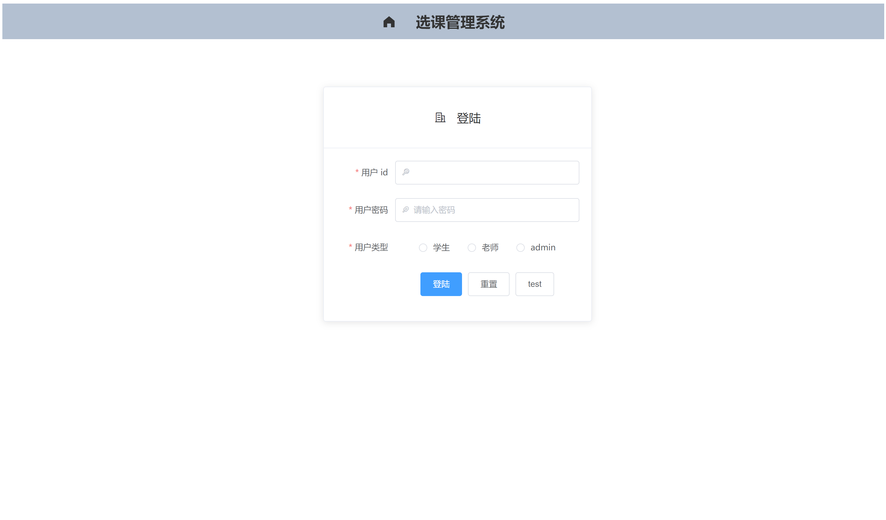
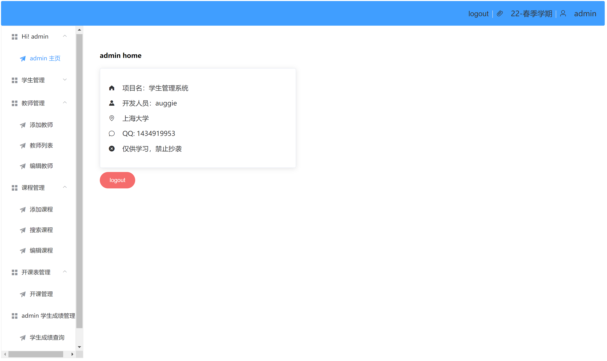
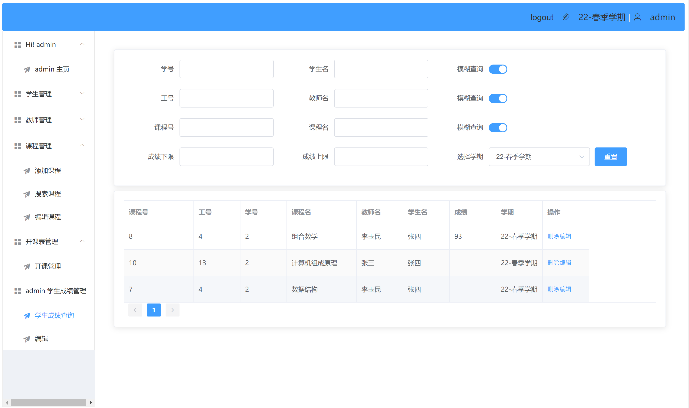
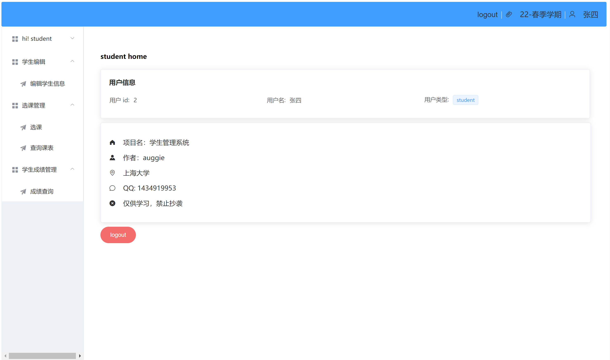
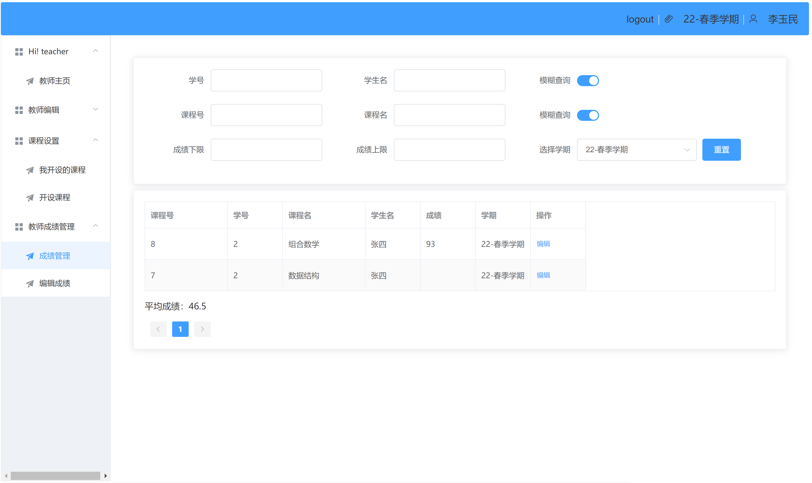
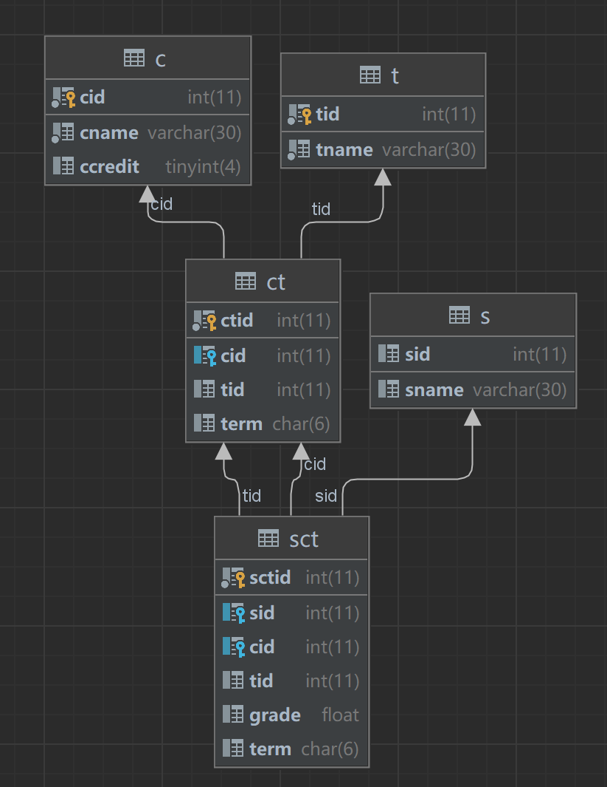

# 项目介绍


这是一个采用前后端分离开发的项目，前端采用 Vue 开发、后端采用 Spring boot + Mybatis 开发。


## 项目部署

如果你有 docker 的话，直接 `docker compose up` 即可启动🌴


1. star 一下项目
2. 将 `studentms.sql` 导入数据库，参考下文数据库配置
3. 运行 `student_client_localhost` 前端
4. 运行后端
   1. 方法 1 ，配置 `student_server` 后端的 yml 文件 ，以及 `port` 为 10086。
   2. 方法 2 ，直接运行 `java -jar student-server.jar` 文件，但是必须保证数据库中 `root` 账号的密码是 `123`
## 项目展示

1. 登陆界面



2. admin 主界面



3. 动态搜索框与表格展示



4. 学生端首页展示



5. 教师端成绩搜索与编辑



# 前端部分

## 项目运行

**由于涉及大量的 ES6/7 等新属性，node 需要 6.0 以上版本**

```shell
git clone git@github.com:ruanjiancheng/StudentManageSystem.git

cd /StudentManageSystem/student_client

npm install

npm run serve
```

## 技术栈

- Vuex
- Router
- Axios
- Element ui
- sessionStorage

## 项目介绍

采用 vue 2.0 开发,通过调用后端提供的数据接口实现数据的动态渲染. 项目默认端口号 8080

- 使用监视器,得益于 Mybatis 强大的动态 SQL 功能,实现高性能动态搜索功能
- 使用 router 配置路由,实现不同用户类型导航栏的动态渲染
- 使用 axios 异步加载后端数据
- 使用 element ui 实现表单的前端校验功能
- 使用 sessionStorage 实现登录拦截
- 分别实现了基于前端和后端的数据分页功能

## 系统功能

1. admin
   1. 实现对教师, 学生, 课程的 CRUD
   2. 实现对教师业务以及学生业务的全方位控制
2. teacher 
   1. 实现查询我开设的课程, 以及选择我课程的学生信息
   2. 对学生成绩的登陆
3. student
   1. 实现选课退课的功能
   2. 实现成绩查询的功能


# 后端部分

## 项目运行

**JDK 版本需要 17.0.2**
```shell
git clone git@github.com:ruanjiancheng/StudentManageSystem.git

cd /StudentManageSystem/student_server

# 必须保证 root 账号的密码是 123，否则无法连接数据
# 也可以自己配置 application.yml 文件的数据库连接，并运行
java -jar student_server.jar

```

## 技术栈

- Spring boot 2.6.3
- Mybatis
- Maven

## 项目介绍

采用 Restful 风格开发,采用 CrossOrigin 解决跨域问题. 采用注解以及 xml 文件配置 SQL 语句, 实现动态 SQL 的功能. 为前端提供完备的数据接口.

由于 vue 项目占用了 8080 Tomcat 默认端口，所以指定项目启动在 10086 端口, 可以使用 YAML 文件配置。使用 Maven 项目进行打包。

## 系统功能

实现前端 Ajex 请求的全部数据接口，Get 请求通过 RESTful 风格开发。


# 数据库设计



建立数据库：

```shell
mysqld -u$Username -p$Password studentms < studentms.sql
```


# 项目存在的问题

- 由于是第一次编写 Vue 项目, 代码复用做得并不是很好. 导致许多组件代码量巨大. 
- 动态搜索导致前端频繁调用数据接口, 使得性能降低. 考虑使用 mybatis 的缓存解决.
- 期间多次因为太菜了, 导致功能实现不了. 感谢博客园的大佬相助. 
- admin 中的学生查询为过时版本的查询，由于代码与教师查询相似而且代码量巨大，没有修改学生端的查询。~~我真的不是懒狗~~
- axios 没有实现 url 的全局封装，导致部署服务器的时候修改 url 比较麻烦。


[](https://star-history.com/#ruanjiancheng/StudentManageSystem&Date)

